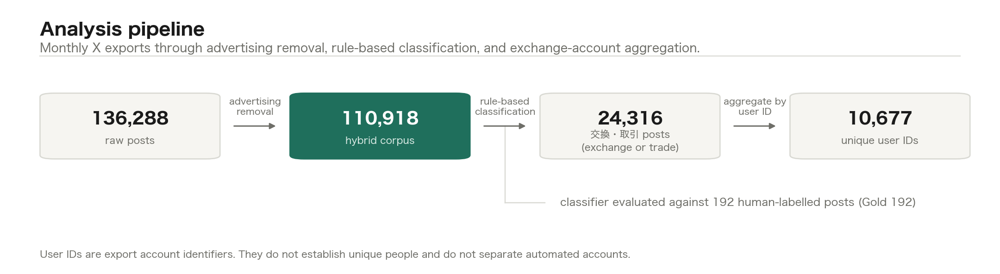
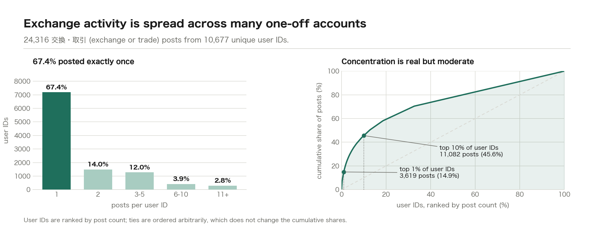

# Bonbon Drop Seal Social Media Analysis

[](https://github.com/bsw0610/sns-analysis/actions/workflows/test.yml)

An analysis of Japanese X posts about Bonbon Drop Seal, covering text preprocessing, Word2Vec, rule-based behavior classification, evaluation, and reproducible presentation metrics.

## Key Results

- **136,288** Japanese X posts analyzed
- **110,918** posts retained after advertising-filter audit
- Classifier evaluated against **192 human-labelled posts**
- **24,316** exchange posts across **10,677 user IDs**
- **Micro F1: 0.595** (multi-label criterion; 0.577 lenient) with documented category-level failure analysis
- Reproducibility verified with regression tests, SHA-256 checks, and CI

## 日本語概要

本プロジェクトでは、2025年11月から2026年4月までに収集した「ボンボンドロップシール」関連のX投稿136,288件を対象に、広告除去、テキスト前処理、Word2Vec、感情・行動カテゴリ分類、交換投稿の分析を行いました。

本研究は4人構成の大学ゼミ共同プロジェクトとして始まりました。データ準備、初期の広告除去、探索的分析、発表はチーム全体の作業です。その後の確認作業で、私が無作為抽出による精度検証を行い、それに基づいてコーパスの追加作業を進めました。本リポジトリに残るキーワードフィルタとルールベース分類器のコードは私が作成したものです。当初の分析では、研究室で共有されていたNotebookとUserLocal Social Insightのデータを利用し、MeCabによる分かち書き、Word2Vec学習、TensorFlow Embedding Projectorでの探索を実施しました。研究室提供Notebookは再配布条件を確認できないため公開せず、処理内容とデータ系譜のみを文書化しています。

その後、広告除去や集計方法によって結果が大きく変わることが分かったため、私が個人で既存コードとデータの流れを再調査しました。私が担当した主な作業は、既存パイプラインとデータ系譜の調査、既存広告フィルタの監査と修正、hybrid corpus 110,918件の再構築と検証、Gold label 192件による評価と誤り分析、交換投稿とアカウント集中度の分析、スライド指標の監査、再現性検証と回帰テスト、CI、公開ドキュメントの整備です。この調査・改善の過程ではAIコーディングエージェントも使用しました。

本リポジトリは、当初のゼミ研究の単独著作を主張するものではありません。

現在の基準データは、月別原票136,288件から広告を除去したhybrid corpus 110,918件です。ルールベース分類では「交換・取引」が24,316件、関連するユニークユーザーIDが10,677件でした。分類器はGold label 192件に対して、多重ラベル基準のmicro F1が0.595、macro F1が0.495でした。特に「焦り・競争」と「情報共有」の性能が低く、広告除去の偏りや日本語表現の取りこぼしが課題として残っています。

## Team Project Context

This research originated as a four-person university seminar project. The
dataset preparation, the initial advertising removal, the exploratory analysis,
and the seminar presentation were team work.

This repository is maintained by the repository owner as a portfolio and
reproducibility project. It documents both the original seminar workflow and
the additional investigation, revision, validation, and reproducibility work
carried out afterward.

It should therefore not be read as claiming sole authorship of the original
seminar project.

The repository's own evidence sets the boundary between the two phases. Version
control begins on 2026-07-30, so the earlier seminar work carries no per-file
authorship record here; the [Project Timeline](docs/01_PROJECT_TIMELINE.md)
marks that period accordingly rather than assigning it to an individual.

## My Contributions

The work below is the individual follow-up phase represented by the scripts,
documents, and figures in this repository.

- Wrote the advertising keyword filter (`filter_ads_202511_202604.py`) and the
  rule-based classifier (`classify_sns_rule_based.py`) that the repository retains
- Checked the accuracy of the team's advertising removal by drawing random
  samples for manual review (`sample_100_posts.py`, and the filter-check extract
  in `make_task5_task6_files.py`), then extended the corpus work on that basis
- Investigated the existing notebooks, scripts, and data lineage
- Audited the advertising-filter workflow, identified over-filtering against
  `情報共有`, and revised and validated the filtering logic
- Reconstructed and validated the 110,918-post hybrid corpus, locking by post ID
  the 391 decisions whose original implementation is missing
- Built the human-label evaluation set, from the original 200-post sample
  (`make_gold_standard_200.py`) through to the normalized Gold 192, and scored
  the classifier against it under both criteria
- Analysed classifier errors by category and traced each to a specific rule defect
- Analysed exchange activity and account concentration
  (`make_task3_exchange_accounts.py`)
- Audited the presentation metrics and regenerated the analytical assets from
  validated data
- Built the reproducibility checks: deterministic rebuild verification, SHA-256
  baselines, and the 28 regression cases in `test_sentiment_classifier.py`, each
  recording a real misclassification that was found and fixed
- Added the synthetic runnable sample and GitHub Actions CI
- Reorganized the documentation and prepared the public repository

The original seminar research, the initial data preparation, the initial
advertising removal, and the seminar presentation were team work and are not
claimed here. The individual contribution to the filtering is the later
accuracy check and the corpus work that followed it, not the original removal
decision.

## Overview

This repository documents two related analysis tracks:

1. A historical word-level workflow based on lab-provided cleaning and Word2Vec notebooks, MeCab tokenization, and TensorFlow Embedding Projector.
2. A post-level workflow that removes advertising content, assigns one of seven emotion or behavior categories, evaluates the classifier against human labels, and analyzes exchange activity.

The most reproducible path currently available is:



The classification step also produces the validated slide metrics and candidate presentation assets.

## Try It Without the Dataset

The collected posts are not in this repository, so a fresh clone cannot rerun
the study. It can still run the classifier: `sample_data/` holds 30 synthetic
posts written for this purpose. No dataset and no third-party packages are
needed.

```bash
python3 classify_sns_rule_based.py \
  --input sample_data/sample_posts.csv \
  --output sample_output.csv

python3 sample_data/check_sample_output.py sample_output.csv
```

```text
OK: 30 rows classified, 21/30 match the intended label
OK: 9 known disagreements reproduced exactly
```

The nine failures are deliberate. They are the weaknesses measured against the
human-labelled evaluation set — the `\b交換\b` word-boundary defect, the
information-sharing category scoring F1 0.000, and indirect expressions that
match no rule — so the limitations described below can be watched happening
rather than taken on trust. [`sample_data/README.md`](sample_data/README.md)
maps each one to its cause, and `check_sample_output.py` pins the exact outcome
so a behaviour change fails loudly instead of passing unnoticed. CI runs this
same sequence on every push.

The older Word2Vec path and several legacy presentation artifacts are documented for provenance, but parts of their preprocessing history are incomplete. The two lab-provided notebooks are intentionally excluded from the public repository because their redistribution terms could not be verified. See [Project Timeline](docs/01_PROJECT_TIMELINE.md) for the evidence-backed reconstruction.

## Motivation and Background

The project began as a four-person seminar study of Japanese social media posts about ボンボンドロップシール. That original process used UserLocal Social Insight exports and notebooks shared for text cleaning and Word2Vec analysis, and its data preparation, advertising removal, and presentation were collaborative.

Later analysis focused on questions that word embeddings alone could not answer directly:

- How much advertising content should be removed before analysis?
- What emotions or behaviors appear in the posts?
- How accurately can a rule-based classifier identify those categories?
- How large is the exchange and trade segment?
- Is exchange activity concentrated among a small number of user IDs?
- Can the reported numbers and slide assets be reproduced from preserved inputs?

The repository therefore includes both exploratory research artifacts and later reproducibility work.

## Source Material and Contribution Boundaries

The material here falls into three categories.

**1. Lab- or seminar-provided reference notebooks.** Two notebooks used in the
original workflow were supplied through a university seminar or lab and were not
authored from scratch by the repository owner. One cleaned extracted post text
with regular expressions; the other trained a Gensim Word2Vec model and exported
`vector.tsv` and `metadata.tsv` for TensorFlow Embedding Projector. Their
redistribution terms could not be verified, so the notebook files and their full
source code or cell outputs are not included in the public Git history. This
repository documents only their observed role in the historical workflow.

**2. Four-person seminar team work.** The dataset preparation, the initial
advertising removal, the exploratory analysis, and the seminar presentation were
carried out by the team as a whole. The repository holds no record of who
performed which task within that phase, and none is attributed here. One step
from it left no source at all: the code that produced `2511-2604_final.csv` is
missing, which is why its 391 remaining decisions are locked by post ID rather
than reimplemented.
Version control begins after that phase, so this repository holds no evidence of
who performed any individual task within it, and it does not attribute those
tasks to one person.

**3. Subsequent individual work.** The advertising-filter audit, hybrid-corpus
reconstruction, Gold 192 normalization and evaluation, classifier error
analysis, exchange-account analysis, presentation-metric verification,
reproducibility checks, regression tests, synthetic sample, CI, and public
repository organization are the repository owner's later work. They are
represented by the scripts and documents retained here, and are listed in
[My Contributions](#my-contributions).

## Data Scope

The monthly X exports cover November 2025 through April 2026.

| File | Logical records |
| --- | ---: |
| `202511.csv` | 12,907 |
| `202512.csv` | 17,037 |
| `202601.csv` | 24,721 |
| `202602.csv` | 31,597 |
| `202603.csv` | 20,260 |
| `202604.csv` | 29,766 |
| **Total** | **136,288** |

The raw datasets are not tracked by Git. They may also contain line breaks inside fields, so physical line counts such as `wc -l` must not be treated as post counts.

## Methodology

### Original word-level workflow

The original workflow used the following sequence:

```text
UserLocal Social Insight CSV exports
  -> INPUT.csv
  -> INPUT_new.csv
  -> cleaning notebook
  -> clean.csv
  -> MeCab / mecab-ipadic-neologd
  -> clean.wakati
  -> Word2Vec
  -> clean.model
  -> vector.tsv / metadata.tsv
  -> TensorFlow Embedding Projector
```

During a read-only local audit, the lab-provided Word2Vec notebook recorded a model trained on June 4, 2026 with the following parameters. The notebook itself is not redistributed in this repository.

| Parameter | Value |
| --- | ---: |
| Architecture | skip-gram (`sg=1`) |
| Vector size | 350 |
| Window | 15 |
| Minimum count | 5 |
| Negative samples | 10 |
| Epochs | 10 |
| Vocabulary | 71,408 |

The current `metadata.tsv` and `vector.tsv` contain 17,298 rows, so they do not represent the full 71,408-word vocabulary. The export rule for this subset is unknown.

### Advertising removal and hybrid corpus

The initial advertising removal was team work. The keyword filter retained in this repository, `filter_ads_202511_202604.py`, produces the 109,037-post result from the 136,288 source posts. The later audit of that workflow found that broad keywords disproportionately removed posts the classifier would label as `情報共有`.

The current hybrid baseline, reconstructed from the preserved inputs and decisions, retains 110,918 posts. It restores 2,015 posts from the earlier result while continuing to exclude the existing 5,874 additional-advertising IDs. Because the original source code for `2511-2604_final.csv` is missing, 391 final-filter decisions are preserved as an ID lock in `baselines/hybrid_final_exclusions.csv` rather than reconstructed from guessed rules.


See [Hybrid Baseline Rebuild](docs/hybrid_rebuild.md) for the exact inputs, hashes, and verification contract.

### Rule-based classification

`classify_sns_rule_based.py` normalizes text with NFKC and case folding, removes URLs and mentions, applies weighted regular expressions, and assigns one primary category.

The seven labels are preserved in Japanese because they are dataset and output column values:

| Label | English description |
| --- | --- |
| `不満・怒り` | dissatisfaction or anger |
| `焦り・競争` | urgency or competition |
| `交換・取引` | exchange or trade |
| `欲望・執着` | desire or fixation |
| `喜び・満足` | joy or satisfaction |
| `情報共有` | information sharing |
| `中立` | neutral / no active rule |

### Human-label evaluation

The current evaluation set contains 192 posts:

- 189 labeled posts sampled from the older 109,037-post corpus
- 3 supplemental posts retained by the hybrid corpus

This is not a simple random sample of all 110,918 hybrid posts. The three supplemental labels are preserved in the baseline, but their original annotation provenance is not available.

### Exchange analysis

The exchange analysis aggregates posts whose primary category is `交換・取引` by `ユーザーID`.



| Metric | Result |
| --- | ---: |
| Exchange posts | 24,316 |
| Unique user IDs | 10,677 |
| Mean posts per user ID | 2.28 |
| Median posts per user ID | 1 |
| User IDs with one post | 7,198 (67.4%) |
| Top 1% of user IDs | 3,619 posts (14.9%) |
| Top 10% of user IDs | 11,082 posts (45.6%) |
| Template-like exchange posts | 12,411 (51.0%) |

`ユーザーID` identifies an account in the export. It does not establish a unique person or distinguish human accounts from automated accounts.

## Results

### Gold 192 classifier evaluation

| Evaluation | Micro F1 | Macro F1 | Additional result |
| --- | ---: | ---: | --- |
| Multi-label threshold | 0.595 | 0.495 | Exact match: 103/192 (0.536) |
| Lenient primary-label match | 0.577 | 0.450 | Hit rate: 118/192 (0.615) |

Lenient per-category F1 scores:

| Category | F1 |
| --- | ---: |
| `交換・取引` | 0.869 |
| `中立` | 0.625 |
| `喜び・満足` | 0.516 |
| `不満・怒り` | 0.471 |
| `欲望・執着` | 0.373 |
| `焦り・競争` | 0.294 |
| `情報共有` | 0.000 |

The classifier is most reliable for exchange posts. It performs poorly on urgency and information sharing, mainly because of missing Japanese inflections and synonyms, incomplete negation handling, and rule interactions.

## Tech Stack

Current repository scripts:

- Python 3
- Matplotlib 3.10.6
- Pillow 12.0.0
- CSV and JSON processing with the Python standard library

Historical notebook workflow, documented but not redistributed or reconstructed:

- Jupyter Notebook
- Gensim / Word2Vec
- MeCab with `mecab-ipadic-neologd`
- TensorFlow Embedding Projector

Supporting tools:

- Git for provenance and reproducibility work
- AI coding agents for repository inspection, pipeline tracing, code revision, and verification

A pinned `requirements.txt` is provided for the current repository scripts. It does not reconstruct the historical notebook-based Word2Vec environment.

## Repository Structure

```text
.
├── README.md
├── LICENSE
├── requirements.txt
├── .github/workflows/test.yml      # runs the tests and the sample on every push
├── assets/portfolio/               # README figures, regenerated from data/output
├── baselines/
│   └── hybrid_final_exclusions.csv # ID lock for 391 unreproducible filter decisions
├── data/output/                    # local generated data; ignored by Git
├── outputs/                        # local presentation artifacts; ignored by Git
├── sample_data/                    # synthetic posts; runnable without the dataset
│   ├── sample_posts.csv
│   ├── check_sample_output.py
│   └── README.md
├── docs/
│   ├── README.md                   # documentation index and reading order
│   ├── 01_PROJECT_TIMELINE.md
│   ├── hybrid_rebuild.md
│   ├── baseline_evaluation.md
│   ├── slide_metric_audit.md
│   ├── slide_assets_regeneration.md
│   ├── slide_plan_10-16.md
│   ├── presentation_script_10-16_ja.md
│   └── task0_total_count.md
└── *.py                            # 19 scripts, listed by role below
```

### Scripts

Every Python file in the repository root is listed here, so that no file is
left ambiguous between current and legacy code.

**Pipeline** — building and classifying the corpus.

| File | Role |
| --- | --- |
| `filter_ads_202511_202604.py` | Advertising rules and monthly-export loading; the shared source of the filter definitions. |
| `build_hybrid_corpus.py` | Rebuilds the 110,918-post hybrid corpus, applying the ID lock for the decisions whose original code is missing. |
| `classify_sns_rule_based.py` | The v2.0.0 rule-based classifier. |
| `normalize_gold_standard_192.py` | Produces the authoritative Gold 192 evaluation set from the 20-column source archive. |
| `evaluate_v2_hybrid_192.py` | Scores the classifier against Gold 192 under both criteria. |
| `slide_number_definitions.py` | Shared metric definitions used by the reporting and verification scripts. |

**Verification** — checking that results still reproduce.

| File | Role |
| --- | --- |
| `verify_hybrid_rebuild.py` | Row counts, ID sets and order, SHA-256 hashes, label preservation, and repeat-run determinism for the rebuild. |
| `verify_slide_numbers.py` | Checks every metric quoted in the presentation specification against the data. |
| `verify_slide_assets.py` | Checks the regenerated slide PNGs against their locked definitions. |
| `audit_slide_number_definitions.py` | The one-off audit that produced [Presentation Metric Audit](docs/slide_metric_audit.md). |

**Tests** — run in CI on every push.

| File | Role |
| --- | --- |
| `test_sentiment_classifier.py` | 28 regression cases recording real misclassifications that were found and fixed. |
| `test_slide_number_definitions.py` | Unit tests for the shared metric definitions. |

**Figures and slides.**

| File | Role |
| --- | --- |
| `make_portfolio_figures.py` | The three README figures, re-derived from `data/output` with a drift guard. |
| `regenerate_slide_assets.py` | Slide 13–16 PNG candidates from the locked definitions. |
| `make_task3_exchange_accounts.py` | Produces `exchange_accounts.csv`, the per-account aggregation the exchange figure reads. |

**Sampling and provenance.** These ran once. They are kept because they are the
record of how the preserved inputs under `data/output/` were produced, not
because the current pipeline calls them.

| File | Produced |
| --- | --- |
| `make_gold_standard_200.py` | The original 200-post annotation sample. |
| `make_task5_task6_files.py` | `gold_standard_192.csv`, the 20-column source archive that the normalizer reads, and a 30-row advertising-filter check sample. |
| `sample_100_posts.py` | A 100-post random sample for manual review. |
| `sample_negotiation_nonexchange_50.py` | The 50-post negotiation sample used by the slide 16 assets. |


Important documentation, with a full index and reading order in
[docs/README.md](docs/README.md):

- [Project Timeline](docs/01_PROJECT_TIMELINE.md)
- [Sentiment Analysis Methodology](sns_sentiment_analysis_guide.md)
- [Hybrid Baseline Rebuild](docs/hybrid_rebuild.md)
- [Classifier Baseline Evaluation](docs/baseline_evaluation.md)
- [Presentation Metric Audit](docs/slide_metric_audit.md)

## Reproducibility and How to Run

### Requirements

Install the dependencies used by the current repository scripts:

```bash
python3 -m pip install -r requirements.txt
```

The reproducible hybrid path requires the six monthly CSV exports and local files under `data/output/`. These files are ignored by Git and are therefore not available in a fresh clone.

The historical cleaning and Word2Vec notebooks are also excluded because their redistribution terms could not be verified. The current public repository therefore documents that legacy path but does not claim that a fresh clone can rerun it end to end.

Run the commands below from the repository root with `python3`. The paths shown for `--output` and `--rebuild-dir` are the script defaults, so they can be omitted; `rebuild/` is ignored by Git and is kept separate from `data/output/` so the preserved baselines are never overwritten.

### Rebuild the hybrid corpus

```bash
python3 build_hybrid_corpus.py \
  --output rebuild/2511-2604_hybrid.csv
```

### Run the classifier

```bash
python3 classify_sns_rule_based.py \
  --input rebuild/2511-2604_hybrid.csv \
  --output rebuild/sentiment_classified_hybrid.csv
```

### Normalize the Gold 192 dataset

```bash
python3 normalize_gold_standard_192.py \
  --input data/output/gold_standard_192.csv \
  --output rebuild/gold_standard_192_normalized.csv \
  --supplement data/output/gold_supplement_11.csv \
  --hybrid rebuild/sentiment_classified_hybrid.csv
```

### Verify the rebuild

```bash
python3 verify_hybrid_rebuild.py \
  --rebuild-dir rebuild
```

The verification checks row counts, columns, values, ID sets, ID order, full SHA-256 hashes, Gold label preservation, and repeat-run determinism.

### Regenerate the README figures

```bash
python3 make_portfolio_figures.py
```

The generator reads only existing outputs under `data/output/`. It re-derives every
number it draws and refuses to render if any value stops matching the published
baseline, so the figures cannot drift away from the documented results.

### Run unit tests

```bash
python3 -m unittest \
  test_sentiment_classifier.py \
  test_slide_number_definitions.py
```

## Limitations

- The original Social Insight query, keyword registration date, and export timestamps are not preserved.
- The raw and generated datasets are excluded from Git, so a fresh clone cannot reproduce the analysis by itself.
- `INPUT.csv`, `INPUT_new.csv`, `clean.csv`, and `clean.wakati` contain unresolved lineage or duplication issues.
- The exact MeCab and `mecab-ipadic-neologd` versions used for the historical run are unknown.
- The original source code for the final advertising filter is missing; 391 decisions are preserved as an ID lock.
- Gold 192 is not a simple random sample of the hybrid corpus.
- The rule-based classifier has known weaknesses in Japanese inflection, negation, synonym coverage, and category interactions.
- Word2Vec training used repeated text blocks and an unlocked environment, so exact retraining equivalence is not guaranteed.
- The lab-provided cleaning and Word2Vec notebooks are documented but not redistributed; the historical word-level workflow is therefore not independently runnable from this repository alone.
- The repository does not contain the code that originally generated some legacy Office and Canva artifacts.

## Future Work

- Rebuild the pipeline as explicit provenance-preserving tables, from raw posts through filtering, classification, evaluation, and exchange aggregation.
- Replace shell-based CSV concatenation and field extraction with schema-aware parsing.
- Create a representative evaluation sample directly from the hybrid corpus and document the annotation policy.
- Improve Japanese linguistic coverage and compare the rule-based baseline with alternative classifiers.
- Reconstruct and separately pin the historical MeCab and Word2Vec environment, and investigate the repeated corpus blocks.
- Replace the legacy notebook-dependent cleaning and Word2Vec steps with independently authored, documented implementations if that workflow is continued.
- Add a fully resolved lockfile for the current scripts if exact transitive dependency reproduction is required, and add a manifest for local, non-Git data assets.

## License

The code in this repository is released under the [MIT License](LICENSE). It does not cover the collected posts, which are not distributed here, or the lab-supplied notebooks described under Source Material and Contribution Boundaries.
